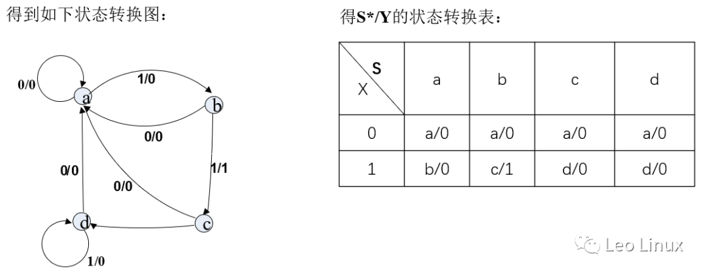

<!--more-->

# 一、数字音频背景
## 1.1 数字音频简介
       声音在自然界以声波的形式存在，是一系列连续变化的模拟信号，声音的三个要素是音调、音强和音色。声波有三个重要参数：频率 ω0、幅度A n 和相位ψn ，这也就决定了音频信号的特征。根据声波的特征，可把音频信息分类为规则音频和不规则声音。其中规则音频又可以分为语音、音乐和音效。音频信号是（Audio）带有语音、音乐和音效的有规律的声波的频率、幅度变化信息载体。

### 1.1.1 数字音频
       数字音频是一种利用数字化手段对声音进行录制、存放、编辑、压缩或播放的技术，它是随着数字信字音频号处理技术、计算机技术、多媒体技术的发展而形成的一种全新的声音处理手段。 数字音频计算机数据的存储是以0、1的形式存取的，那么数字音频就是首先将音频文件转化，接着再将这些电平信号转化成二进制数据保存，播放的时候就把这些数据转换为模拟的电平信号再送到喇叭播出，数字声音和一般磁带、广播、电视中的声音就存储播放方式而言有着本质区别。相比而言，它具有存储方便、存储成本低廉、存储和传输的过程中没有声音的失真、编辑和处理非常方便等特点。

### 1.1.2 数字音频文件
       数字音频文件是通过声音录入设备录制的原始声音，直接记录了真实声音的二进制采样数据，有些文件并对原始数据进行了频率过滤和存储格式压缩，音频文件格式主要分有损和无损两类。有损文件格式是基于声学心理学的模型，除去人类很难或根本听不到的声音。 
无损格式，例如PCM，WAV，ALS，ALAC，TAK，FLAC，APE，WavPack(WV) ；
有损格式，例如MP3，AAC，WMA，Ogg ；
       数字音频文件几个重要参数：采样频率、量化位宽、声道数。

### 1.1.3 采样频率
       采样频率是指将模拟声音波形进行数字化时，每秒钟抽取声波幅度样本的次数。采样频率的选择应该遵循奈奎斯特（Harry Nyquist）采样理论：如果对某一模拟信号进行采样，则采样后可还原的最高信号频率只有采样频率的一半，或者说只要采样频率高于输入信号最高频率的两倍，就能从采样信号系列重构原始信号。正常人听觉的频率范围大约在20Hz~20kHz之间，根据奈奎斯特采样理论，为了保证声音不失真，采样频率应该在40kHz左右，常用的采样率有： 
**1）**8,000 Hz - 电话所用采样率,对于人的说话已经足够 ；
**2）**11,025 Hz ；
**3）**22,050 Hz - 无线电广播所用采样率 ；
**4）**32,000 Hz - miniDV 数码视频camcorder、DAT (LP mode)所用采样率 ；
**5）**44,100 Hz - 音频CD,也常用于MPEG-1音频（VCD, SVCD, MP3）所用采样率 ；
**6）**47,250 Hz - 商用 PCM 录音机所用采样率 ；
**7）**48,000 Hz - miniDV、数字电视、DVD、DAT、电影和专业音频所用的数字声音所用采样率 ；
**8）**50,000 Hz - 商用数字录音机所用采样率 ；
**9）**96,000 或者 192,000 Hz - DVD-Audio、一些LPCM DVD音轨、BD-ROM（蓝光盘）音轨、和HDDVD（高清晰度DVD）音轨所用所用采样率 ；
**10）**2.8224 MHz - Direct Stream Digital 的1位sigma-delta modulation过程所用采样率。

### 1.1.4 量化位宽
       量化位宽是对模拟音频信号的幅度进行数字化，它决定了模拟信号数字化以后的动态范围，常用的有8位、12位、16位、24位和32位。量化位越高，信号的动态范围越大，数字化后的音频信号就越可能接近原始信号，但所需要的存贮空间也越大。

### 1.1.5 声道数
       声道数是反映音频数字化质量的另一个重要因素，声道技术已广泛运用于各类传统影院和家庭影院中。 
**1）**单声道的声道数为1个声道； 
**2）**双声道的声道数为2个声道，立体声道的声道数默认为2个声道； 
**3）**四声道环绕规定了4个发音点：前左、前右，后左、后右，4.1声道音箱系统其中“.1”声道，则是一个专门设计的超低音声道，这一声道可以产生频响范围20～120Hz的超低音；
**4）**5.1声音系统其实来源于4.1环绕，不同之处在于它增加了一个中置单元。这个中置单元负责传送低于80Hz的声音信号，在欣赏影片时有利于加强人声，把对话集中在整个声场的中部，以增加整体效果；
**5）**7.1系统已经出现，它在5.1的基础上又增加了中左和中右两个发音点，以求达到更加完美的境界。

## 1.2 linux音频子系统介绍
**声明：** 本章节部分内容引用了博文《Linux 音频系统简析》，网址：http://blog.csdn.net/meizum10/article/details/17437959
       Linux音频系统比较复杂，各层间有很多交叉，可能是最无序的子系统，并且它有两套音频驱动框架: OSS (Open Sound System)和ALSA (Advanced Linux Sound Architechture)，所以底层驱动有OSS和ALSA两套API。ALSA经过多年的发展，基本统一了Linux声卡硬件驱动层的接口，OSS日渐退出，但是在ALSA之上的各个应用层，方案和软件繁多复杂，ESD，PulseAudio, JACK,GStreamer, 这些系统组件各个为战，实现了不同的功能。

       上图1.2描述了Linux音频系统各部分调用关系，下面简要介绍各部分。

### 1.2.1 ALSA和OSS
       ALSA 是 Advanced Linux Sound Architecture 的缩写，即高级 Linux声音架构,在 Linux 操作系统上提供了对音频和 MIDI（Musical InstrumentDigital Interface，音乐设备数字化接口）的支持。在 Linux2.6 版本内核以后，ALSA 已经成为默认的声音子系统，用来替换 2.4 版本内核中的OSS（Open Sound System，开放声音系统）。
       ALSA 是一个完全开放源码的音频驱动程序集，是由志愿者维护的开源项目，而 OSS 则是由公司提供的商业产品。ALSA 系统包括驱动包alsa-driver（集成在内核源码）,开发包 alsa-libs，开发包插件 alsalibplugins，设置管理工具包 alsa-utils，其他声音相关处理小程序包alsa-tools，特殊音频固件支持包 alsa-firmware，OSS 接口兼容模拟层工具 alsa-oss 共 7 个子项目，其中只有 alsa-driver 是必须的。

### 1.2.2 FFADO
       很多专业音乐设备都是通过“火线”连接到pc的。FFADO项目旨在通过提供一个通用的火线上，支持基于Linux平台的开源音频设备解决方案。FFADO项目是的FreeBOB项目的继任者。FFADO在志愿者为基础的社区的努力下，试图提供Linux至少是存在于其他操作系统功能相同的水平，并且希望支持的火线音频设备的范围非常广泛：从混合音频控制设备到DSP算法设备的纯音频接口。然而，能够支持的是设备供应商的合作。优先考虑提供信息和测试设备的制造商。
       FFADO另一个特性是整合了dsp芯片的混音驱动，你可以通过图形界面设置输入输出，以及音效等。不同于alsa的软混音，你可以真正的对硬件进 行控制，做到真正的0延时，这对现场录音等需求大大有助。和alsa等其他架构不同，jack仅仅对其支持的硬件进行处理，没有对alsa或者pulse提供接口，除非你用alsa替代jack，否则你无 法使用jack正常的进行音频播放。但是很多专业设备对jack支持良好，所以jack是你的最优选择。

### 1.2.3 PulseAudio
       PulseAudio是内置POSIX的操作系统是一个完善的机制，它是声音的应用程序代理。它允许应用程序和硬件之间传递声音数据上的高级操作。诸如将音频传输到不同的机器、改变采样格式或通道计数以及将多个声音混合成一个，这些都很容易使用声音服务器实现。内置专为Linux系统。它也被移植到Solaris、FreeBSD，NetBSD，MacOS X的测试，Windows 2000和Windows XP。内置是所有有关linux系统的一个组成部分，用于由多个供应商的各种移动设备。

### 1.2.4 GStreamer
       GStreamer是一个开源的多媒体框架库。利用它，可以构建一系列的媒体处理模块，包括从简单的ogg播放功能到复杂的音频（混音）和视频（非线性编辑）的处理。应用程序可以透明的利用解码和过滤技术。开发者可以使用简洁通用的接口来编写一个简单的插件来添加新的解码器或滤镜。

### 1.2.5 JACK
       Jack（JACK Audio Connection Kit 的递归缩写）是一个专业级的声音服务（守护进程），它为声音和MIDI数据提供实时的、低延时的连接，有关的程序使用JACK的API。
       JACK能使用ALSA、PortAudio、CoreAudio、FFADO和OSS作为硬件层的后端。此外, 还有一个虚拟的驱动（当不需要声音输出时是很有用的，例如离线渲染）和一个通过UDP协议的音频驱动（Audio-over-UDP driver）。它可以运行在Linux、Mac OS X、Solaris、Windows、FreeBSD、OpenBSD和NetBSD上。JACK的API被标准化，并且存在两种可融合的实现：jack1，由简单的C实现并且已经维护了一段时间；至于jack2（原来的jackdmp），由Stéphane Letz领导的用C++重写的实现，jack2在积极开发中，目标是支持多处理器和对其它非Linux操作系统。

### 1.2.6 Xin
       如果说linux音频发展像地球史，那xine就处在白垩纪。它就像个遗老，你仍能从很多播放器中发现它的身影，所以很多linux发行版仍然捆绑 着xine。xine创立之初，设计分为前端和后端，前端用于和用户交互，后端处理多媒体。得益于封装的解码库，它可以播放包括AVI、Matroska和 Ogg以及它们 包含的数十种格式，例如AAC、Flack、MP3、Vorbis和WMA。因为它依赖于库实现，所以xine被开发成一个多媒体框架，库的开发，使得xine在法律允许范围内对多媒体文件提供最好的支持。xine可以和 alsa，pulse通信，很多程序也可以调用xine，例如totme-xine。同时xine也是kde的Phonon默认后端，所以不论是 Amarok 还是 Kaffeine，都能看到他的踪迹。

### 1.2.7 Phonon
       Phonon是KDE 4的多媒体API 。Phonon提供一个稳定的API允许KDE 4独立于任何一个声音系统服务器如xine。Phonon让各种后端提供界面给开发者所谓的"引擎"；每个引擎运作在一个具体的后端。每个后端都可让Phonon控制基本功能，如播放、暂停和搜寻。Phonon也支持更高层次的功能，如让音轨转化之间变微弱。 使用Solid，Phonon将给予用户更多配件的控制能力如耳机、扬声器、麦克风。一个例子是，因为你可能只有一个VoIP会话使用您的耳机，但所有其他的声音通过扬声器出来。支援 Unix-like 系统下的后端xine、VLC、MPlayer。支援 Windows 下的后端 DirectShow、VLC和MPlayer.支持 Mac OS X下的后端QuickTime。QT4.4和之后版本使用了Phonon，作为跨平台的音频/视频播放。

### 1.2.8、其他
       其他有一些很多小众的音频技术，例如ESD、SDL和 PortAudio。
       
**1)ESD**
       ESD是声音启发守护进程（Enlightenment Sound Daemon），它在曾经很长的一段时间里曾是Gnome桌面的默认声音服务。后来，Gnome开始使用libcanberra（它本身可以和ALSA、 GStreamer、OSS和PulseAudio通信），ESD在2009年4月被彻底放弃支持。在kde上esd也是杯具。因为大部分人都是使用 kde4，所以phonon替代了esd。 
  
**2)SDL**
       SDL依然欣欣向荣的发展着。因为已经是用他开发了上百款跨平台游戏， 所以SDL库的音频输出组件依然支持良好，具有大量新的特性，并且成熟而稳定。 
  
**3)PortAudio**
       PortAudio也是一个跨平台音频库，它把 SGI、Unix和Beos加入到可能的终端混音器中。使用PortAudio的最知名的应用程序就是Audacity音频编辑器了，因为使用了 portaudio，使得它音频输出遇到了问题，jack支持也遇到了bug。

# 二、ALSA框架分析
## 2.1 ALSA框架介绍
### 2.1.1 ALSA简介
       ALSA 是 Advanced Linux Sound Architecture 的缩写，即高级 Linux声音架构,在 Linux 操作系统上提供了对音频和 MIDI（Musical InstrumentDigital Interface，音乐设备数字化接口）的支持。在 Linux2.6 版本内核以后，ALSA 已经成为默认的声音子系统，用来替换 2.4 版本内核中的OSS（Open Sound System，开放声音系统）。 
       ALSA 是一个完全开放源码的音频驱动程序集，是由志愿者维护的开源项目，而 OSS 则是由公司提供的商业产品。ALSA 系统包括驱动包alsa-driver（集成在内核源码）,开发包 alsa-libs，开发包插件 alsalibplugins，设置管理工具包 alsa-utils，其他声音相关处理小程序包alsa-tools，特殊音频固件支持包 alsa-firmware，OSS 接口兼容模拟层工具 alsa-oss 共 7 个子项目，其中只有 alsa-driver 是必须的。除了 alsa-driver，ALSA 包含在用户空间的 alsa-lib 函数库，具有更加友好的编程接口，并且完全兼容于 OSS，开发者可以通过这些高级 API 使用驱动，不必直接与内核驱动 API 进行交互。 
ALSA 主要有如下特点： 
1）支持多种声卡设备；
2）模块化的内核驱动程序； 
3）支持 SMP（对称多处理）和多线程； 
4）提供应用开发函数库 ；
5）兼容 OSS 应用程序 。 

### 2.1.2 ALSA整体框架
       ALSA 在 Linux 系统中可以主要分两部分，在Kernel空间的设备驱动层，ALSA 提供了 ALSA-driver，它是整个 ALSA 框架的核心部分；同时在Linux User空间，ALSA 提供了alsa-lib，对 ALSA-driver的系统调用API进行封装，应用程序只要调用 alsa-lib 提供的 API，即可以完成对底层音频硬件的控制。下图2.1.2是基于ALSA框架的Linux音频系统架构图：


#### 2.1.2.1 alsa-lib
       User空间的 alsa-lib 对应用程序提供统一的 alsa-lib-API 接口，简化了应用程序的实现难度。alsa-lib 主要以 plugin 插件的形式体现。详细信息详见<http://www.alsa-project.org/alsa-doc/alsa-lib/> 。

#### 2.1.2.2 ALSA-driver
       Linux 内核空间中，ALSA-driver 其大致可分为三层：声卡对象描述层、ALSA 核心层 ASLA Core 和 Audio 设备驱动层 Audio device driver。

        最上层的是声卡对象描述层，是声卡硬件的抽象描述，是一个虚拟层，用户空间通过这些描述可以得知该声卡硬件的功能、设备组件和操作方法等。 
        中间层是 ASLA Croe，是 ALSA 的标准框架，是 ALSA-driver 的核心部分，提供了各种音频设备驱动的通用方法和数据结构，为 Audio driver提供 ALSA Driver API。 
        最底层是 Audio device driver，根据 ALSA-driver 提供的 ALSA Driver API 和相应音频设备的初始化及工作流程，实现具体的功能组件函数，这也是驱动开发人员需要具体实现的部分。
        
## 2.2 ALSA的硬件抽象
       ALSA 用 cards，device 和 subdevices 的分层结构表示 Audio 硬件设备和他们的组件。这个分层结构是 ALSA 看待硬件设备结构和能力的视角，是对实体硬件的抽象化实例。见图2.2：


       目前 ALSA 内核提供给用户空间的 device 文件接口有： 
1）Information Interface (/proc/asound) 信息接口；
2）Control Interface (/dev/snd/controlCX) 控制接口；
3）Mixer Interface (/dev/snd/mixerCXDX) 混音器接口；
4）PCM Interface (/dev/snd/pcmCXDX) PCM 接口；
5）Raw MIDI Interface (/dev/snd/midiCXDX) Raw 迷笛接口；
6）Sequencer Interface (/dev/snd/seq) 音序器接口；
7）Timer Interface (/dev/snd/timer) 定时器接口；

### 2.2.1 PCM设备
       ALSA 已经为我们实现了功能强劲的 PCM 中间层，自己的驱动中只要实现一些底层的需要访问硬件的函数即可。要访问 PCM 的中间层代码，你首先要包含头文件<sound/pcm.h>，另外，如果需要访问一些与hw_param 相关的函数，可能也要包含<sound/pcm_params.h>。每个 pcm 实例对应一个 pcm 设备文件。一个 pcm 实例由一个playback stream 和一个 capture stream 组成，这两个 stream 又分别有一个或多个 substreams 组成，见图2.2.1。



### 2.2.2 Control设备  
       Control 接口主要让用户空间的应用程序（alsa-lib）可以访问和控制音频 codec 芯片中的多路开关，滑动控件等。用户空间通过对 Control设备的操作，从而达到操作 CODEC 相关寄存器的目的。
 
### 2.2.3 ALSA设备文件命名规则
       ALSA cards和声卡硬件是一一对应的，ALSA cards主要保存每块卡上的设备列表，一个card可以通过一个ID（字符串）或者从0开始的数字表示。大部分 ALSA 硬件访问发生在 device 级别，可以从 0 开始枚举每个卡的 devices，不同的 devices 可以独立的打开和使用。
       典型的，声卡和设备这两个标识足以决定声音信号从哪里读取，送到哪里。Subdevices 是 ALSA 能够区分的更细粒度的对象。最常见的场景是一个 device 的每个 channel 都对应一个 subdevice 或者总共只有一个subdevice。一个 device 的 subdevice 理论上可以单独使用，但是在一个subdevice 上播放 multi-channel 信号时，也会使用其余的 subdevices。和 device 一样，subdevices 索引标识从 0 开始。

### 2.2.4 ALSA 设备文件实例说明
       下面举例查看某 Linux 系统中 dev/snd 路径下 alsa 驱动设备文件： 
crw-rw----+ 1 root audio 116, 2 4 月 7 18:14 controlC0 
crw-rw----+ 1 root audio 116, 5 4月 7 18:14 controlC1 
crw-rw----+ 1 root audio 116, 3 4 月 7 18:15 pcmC0D3p 
crw-rw----+ 1 root audio 116, 7 4 月 7 18:15 pcmC1D0c 
crw-rw----+ 1 root audio 116, 6 4 月 18 10:38 pcmC1D0p

crw-rw----+ 1 root audio 116, 8 4 月 7 18:14 pcmC1D2c 
crw-rw----+ 1 root audio 116, 1 4 月 7 18:14 seq 
crw-rw----+ 1 root audio 116, 33 4 月 7 18:14 timer 
  
       我们可以看到以下设备文件:
controlCX -->     用于声卡的控制，例如通道选择，混音，麦克风的控制等 
pcmCXDXc -->   用于录音的 pcm 设备 
pcmCXDXp -->   用于播放的 pcm 设备 
seq -->               音序器 
timer -->             定时器 
       其中，CXDX 代表的是声卡 X 中的设备 X，pcmC1D0c 最后一个 c 代表 capture，pcmC1D0p 最后一个 p 代表 playback，这些都是 alsa-driver中的命名规则。从上面的列表可以看出，声卡下挂了 8 个设备，根据声卡的实际能力，驱动实际上可以挂上更多种类的设备。通常最重要的两个设备是 PCM 和 control。      
        
## 2.3 HDA Driver分析
### 2.3.1 HDA硬件系统框架
       HDA(High Definition Audio)是intel设计的用来取代AC97的音频标准，硬件架构上由hda dodec和hda controller组成见图2.3.1：


### 2.3.2 Stream的概念
       HAD 引入了 Streams 的概念来组织数据，并通过 HDA Link 总线进行数据传输。Stream 是一个在系统内存缓冲区和 codec 之间创建的逻辑的或虚拟的连接用以来呈现数据，该连接由单个 DMA 通道通过 Link总线驱动。一个 Stream 包含一个或多个相关的组件或数据 channels，每个 channel 都被动态绑定到 codec 中的一个单一 converter 上来呈现。例如，一个立体声 Stream 包括两个 channels：左和右，在此 Stream 中的每一个采样点应该包括两个采样数据:左和右。这些采样在缓冲区中和在链路上传输的时候是组合在一起的，但是却在 codec 中连接不同的DA 转换器。

### 2.3.3 HDA driver模型介绍
#### 2.3.3.1 重要结构体azx
       azx 是hda controller的结构体，其中struct hda_bus bus、struct snd_card *card、struct pci_dev *pci是三个重要结构体，分别表示总线、卡、设备。其kernel4.6版的结构体见下：
```c
struct azx {
    struct hda_bus bus;

    struct snd_card *card;  
    struct pci_dev *pci;  
    int dev_index;

    /* chip type specific */  
    int driver_type;  
    unsigned int driver_caps;  
    int playback_streams;  
    int playback_index_offset;  
    int capture_streams;  
    int capture_index_offset;  
    int num_streams;  
    const int *jackpoll_ms; /* per-card jack poll interval */

    /* Register interaction. */  
    const struct hda_controller_ops *ops;

    /* position adjustment callbacks */  
    azx_get_pos_callback_t get_position[2];  
    azx_get_delay_callback_t get_delay[2];

    /* locks */  
    struct mutex open_mutex; /* Prevents concurrent open/close operations */

    /* PCM */  
    struct list_head pcm_list; /* azx_pcm list */

    /* HD codec */  
    int  codec_probe_mask; /* copied from probe_mask option */  
    unsigned int beep_mode;

#ifdef CONFIG_SND_HDA_PATCH_LOADER  
    const struct firmware *fw;  
#endif

    /* flags */  
    int bdl_pos_adj;  
    int poll_count;  
    unsigned int running:1;  
    unsigned int single_cmd:1;  
    unsigned int polling_mode:1;  
    unsigned int msi:1;  
    unsigned int probing:1; /* codec probing phase */  
    unsigned int snoop:1;  
    unsigned int align_buffer_size:1;  
    unsigned int region_requested:1;  
    unsigned int disabled:1; /* disabled by vga_switcheroo */

#ifdef CONFIG_SND_HDA_DSP_LOADER  
    struct azx_dev saved_azx_dev;  
#endif  
};
```

#### 2.3.3.2 hda dirver需要实现的操作功能函数
       操作函数主要有两类，一个是IO级操作函数，即寄存器读写；一个是功能级操作函数；

IO级操作：
```c
struct hdac_io_ops {<!-- -->  
    /* mapped register accesses */  
    void (*reg_writel)(u32 value, u32 __iomem *addr);  
    u32 (*reg_readl)(u32 __iomem *addr);  
    void (*reg_writew)(u16 value, u16 __iomem *addr);  
    u16 (*reg_readw)(u16 __iomem *addr);  
    void (*reg_writeb)(u8 value, u8 __iomem *addr);  
    u8 (*reg_readb)(u8 __iomem *addr);  
    /* Allocation ops */  
    int (*dma_alloc_pages)(struct hdac_bus *bus, int type, size_t size,  
                   struct snd_dma_buffer *buf);  
    void (*dma_free_pages)(struct hdac_bus *bus,  
                   struct snd_dma_buffer *buf);  
};
```

功能级操作：
```c
struct hda_controller_ops {
    /* Disable msi if supported, PCI only */  
    int (*disable_msi_reset_irq)(struct azx *);  
    int (*substream_alloc_pages)(struct azx *chip,  
                     struct snd_pcm_substream *substream,  
                     size_t size);  
    int (*substream_free_pages)(struct azx *chip,  
                    struct snd_pcm_substream *substream);  
    void (*pcm_mmap_prepare)(struct snd_pcm_substream *substream,  
                 struct vm_area_struct *area);  
    /* Check if current position is acceptable */  
    int (*position_check)(struct azx *chip, struct azx_dev *azx_dev);  
    /* enable/disable the link power */  
    int (*link_power)(struct azx *chip, bool enable);  
};
```

#### 2.3.3.3 HDA dirver初始化流程
       hda dirver的初始化流程见图2.3.3.3：

                                                                 
# 三、ALSA-lib嵌入式平台移植
       虽然linux下alsa框架给用户空间提供了系统调用，但alsa-lib对系统调用进行进一步封装，并实现了很多插件，例如多音频源进行混音播放时，调用的就是 dmix 插件。

## 3.1 软件包下载
       进入网站<http://www.alsa-project.org/>选择下载合适版本的软件包，见图3.1：


       其中，alsa-lib是ALSA 应用库(必需基础库)，alsa-utils包含一些ALSA小的测试工具.如aplay、arecord 、amixer播放、录音和调节音量小程序，对于一些应用开发者只需要以上两个软件包就可以了。

## 3.2 配置和编译
### 3.2.1 alsa-lib
**1）准备**
       解压alsa-lib-x.x.x.tar.bz2，进入解压后目录：
```html
cd alsa-lib-x.x.x
```

**2）配置**
```html
./configure --host=aarch64-linux-gnu \
--prefix=/usr/local/share/arm64-alsa \
--enable-static=yes --enable-shared=no \
--enable-python=no \
--with-configdir=/usr/local/share/alsa \
--with-plugindir=/usr/local/lib/alsa_lib \
--with-pcm-plugins=hw
```
       其中配置参数--prefix=/usr/local/share/arm64-alsa 是编译后结果的输出路径，--with-configdir=/usr/local/share/alsa它将影响 include/config.h中的 ALSA_CONFIG_DIR 目录。

**3）编译** 
```html
make
```
**4）安装** 
```html
make install
```


### 3.2.2 alsa-utils
**1）准备**
       解压alsa-utils-x.x.x.tar.bz2，进入解压后目录：
```html       
cd alsa-utils-x.x.x
```

**2）配置**
```html
./configure \
--host=aarch64-linux-gnu \
--prefix=/usr/local/share/arm64-alsa CFLAGS="-I/usr/local/share/arm64-alsa/include" LDFLAGS="-L/usr/local/share/arm64-alsa/lib \
--lasound" \
--disable-alsamixer \
--disable-xmlto
```

**3）编译**
```html
make
```

**4）安装**
```html
 make install
```

### 3.2.3 移植
**1）准备：**
       复制目标文件夹下的文件到嵌入式系统的根文件系统：
```html
cp -rfa /usr/local/share/arm64-alsa/lib/*  /initramfs/lib/ 
cp -rfa /usr/local/share/arm64-alsa/bin/*  /initramfs/sbin/ 
cp -rfa /usr/local/share/arm64-alsa/sbin/* /initramfs/sbin/
cp -rfa /usr/local/share/alsa/*  /initramfs/usr/local/share/alsa/
```

**2）配置环境变量：**
       在rootfs/etc/profile，添加如下两行:
```html
alsa_init
export ALSA_CONFIG_PATH=/usr/local/share/alsa/alsa.conf
```

**3）生成跟文件系统：**
```html
find .|cpio -o -H newc|gzip -9 > $(pwd)/initramfs.img.gz
```

## 3.3 相关软件应用
       在alsa-utils包含一些ALSA小的测试工具，这些工具软件都是基于alsa-lib的API实现的，其中amixer可以进行音频通道选通和音量调节，aplay是播放音频软件，arecord是录音软件。
